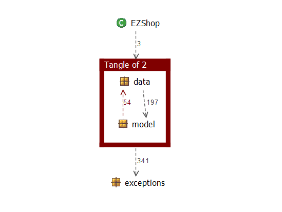

# Design assessment

Authors: Marco Ballario, Pietro Macori, Cosimo Michelagnoli, Lucia Vencato

Date: 01/06/2021

Version: 1.0

# Levelized structure map

# Structural over complexity chart

# Size metrics

| Metric                                    | Measure |
| ----------------------------------------- | ------- |
| Packages                                  |   6     |
| Classes (outer)                           |   40    |
| Classes (all)                             |   40    |
| NI (number of bytecode instructions)      |  6096   |
| LOC (non comment non blank lines of code) |  2621   |

# Items with XS

| Item | Tangled | Fat  | Size | XS   |
| ---- | ------- | ---- | ---- | ---- |
| ezshop.it.polito.ezshop.data.EZShop |         |  242  |  4163  |  2098  |
| ezshop.it.polito.ezshop |    9%    |   4   |   6096   |   553   |
| ezshop.it.polito.ezshop.data.EZShop.modifyCustomer(java.lang.Integer, java.lang.String, java.lang.String):boolean | | 18 | 157 | 26 |

# Package level tangles

# Summary analysis

The main changes have been:
- the removal of the class Position
- the addition of the class Tools
- the addition of the class TicketEntry
- the removal of the reference between the classes BalanceOperation and Order, SaleTransaction, ReturnTransaction
- changes of some methods name in the classes

The weakness of our code is the tangle of 2 cyclically-dependet classes, that are SaleTransaction and ReturnTransaction. 
We could fix it by saving the id of the SaleTransaction in the ReturnTranscation, without having the reference to the object.
We also have a fat class, EZShop, and we could improve it by spreading the code in the other classes.

