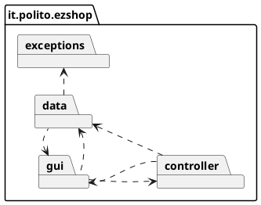
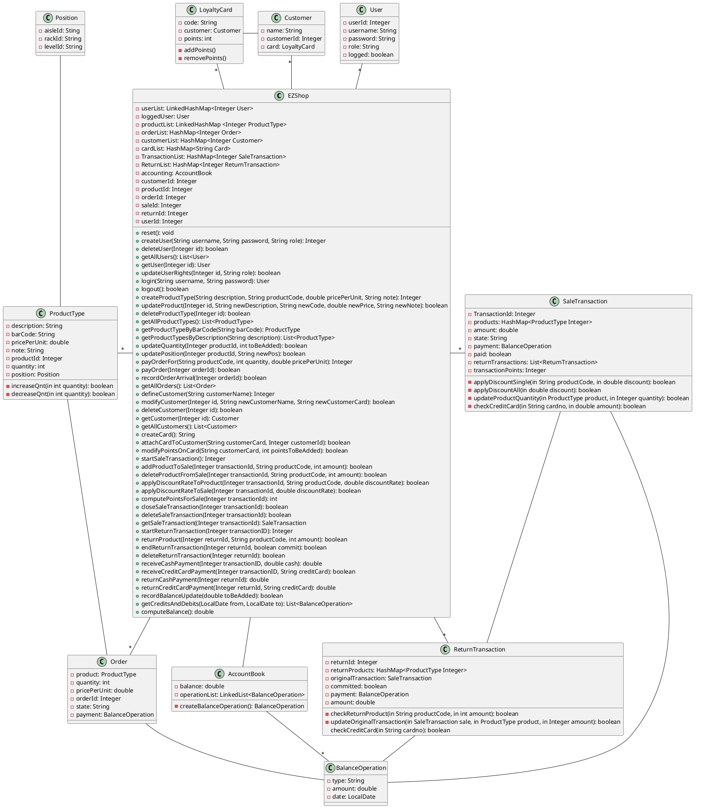

# Design Document 


Authors: Marco Ballario, Pietro Macori, Cosimo Michelagnoli, Lucia Vencato

Date: 30/04/2021

Version: 1.0


# Contents

- [High level design](#package-diagram)
- [Low level design](#class-diagram)
- [Verification traceability matrix](#verification-traceability-matrix)
- [Verification sequence diagrams](#verification-sequence-diagrams)

# Instructions

The design must satisfy the Official Requirements document, notably functional and non functional requirements

# High level design 

<discuss architectural styles used, if any>
<report package diagram>





# Low level design

<for each package, report class diagram>



# Verification traceability matrix

| |User|EZShop|ProductType|Position|Order|Customer|LoyaltyCard|SaleTransaction|ReturnTransaction|BalanceOperation|AccountBook|
|-|----|------|-----------|--------|-----|--------|-----------|---------------|-----------------|----------------|-----------|
|FR1|X|X||||||||||
|FR3||X|X|||||||||
|FR4.1||X|X|||||||||
|FR4.2||X|X|X||||||||
|FR4.3||X|X|||||||||
|FR4.4||X|||X|||||X|X|
|FR4.5||X|||X|||||X|X|
|FR4.6||X|X|X||||||||
|FR4.7||X||X||||||||
|FR5.1-FR5.4||X|||X|||||||
|FR5.5||X|||||X|||||
|FR5.6||X||||X|X|||||
|FR5.7||X|||||X|||||
|FR6.1-FR6.11||X||||||X||||
|FR6.12||X|||||||X|||
|FR6.13||X|X||||||X|||
|FR6.14||X|||||||X|||
|FR7.1-FR7.2||X||||||X||X|X|
|FR7.3-FR7.4||X|||||||X|X|X|
|FR8||X||||||||X|X|

# Verification sequence diagrams 
```plantuml
title Scenario 3.2
EZShop -> EZShop: getOrder()
EZShop -> EZShop: getAccountBook()
EZShop -> AccountBook: createBalanceOperation()
AccountBook -> EZShop: BalanceOperation
EZShop -> Order: setPayment()
Order --> EZShop
```

```plantuml
title Scenario 3.3
EZShop -> EZShop: getOrder()
EZShop -> Order: getProductType()
Order --> EZShop: productType
EZShop -> ProductType: setPosition()
EZShop -> EZShop: recordOrderArrival()
EZShop -> Order: updateProductQuantity()
Order -> ProductType: increaseQnt()
ProductType --> Order: result
Order --> EZShop: result
EZShop -> Order: setState()
```
