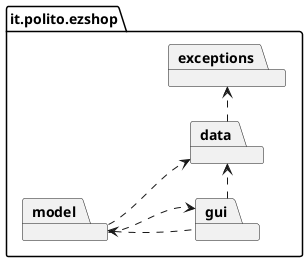
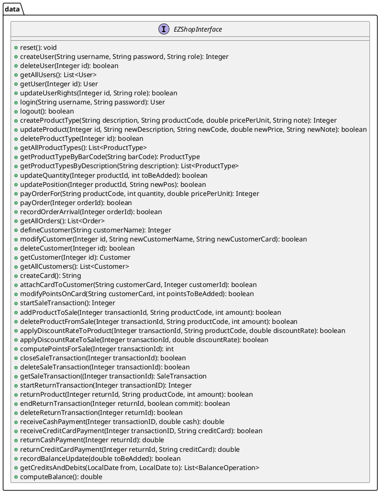
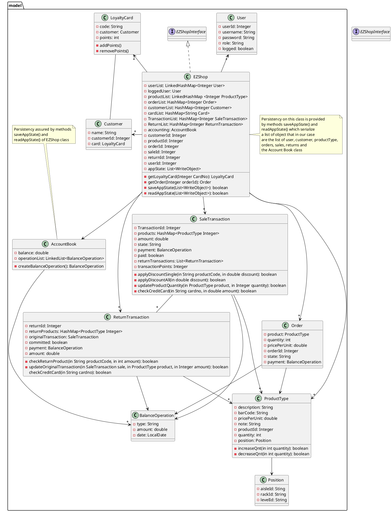

# Design Document 


Authors: Marco Ballario, Pietro Macori, Cosimo Michelagnoli, Lucia Vencato

Date: 30/04/2021

Version: 1.0


# Contents

- [High level design](#package-diagram)
- [Low level design](#class-diagram)
- [Verification traceability matrix](#verification-traceability-matrix)
- [Verification sequence diagrams](#verification-sequence-diagrams)

# Instructions

The design must satisfy the Official Requirements document, notably functional and non functional requirements

# High level design 

The architectural style used is the MVC since we need a model containing data and methods to manipulate them, a view which allows the user to interact with the application and a controller responible to handle events from the user interface. In our specific case we have the model inside the "model" package, the view inside the "gui" package and the interface inside the "data" package. Moreover there is an "exceptions" packaged used to contains all possible exception classes making the model more clean.
Another possible solution would have been to exploit a 3 tier pattern. 





# Low level design


<br>



# Verification traceability matrix

| |User|EZShop|ProductType|Position|Order|Customer|LoyaltyCard|SaleTransaction|ReturnTransaction|BalanceOperation|AccountBook|
|-|----|------|-----------|--------|-----|--------|-----------|---------------|-----------------|----------------|-----------|
|FR1|X|X||||||||||
|FR3||X|X|||||||||
|FR4.1||X|X|||||||||
|FR4.2||X|X|X||||||||
|FR4.3||X|X|||||||||
|FR4.4||X|||X|||||X|X|
|FR4.5||X|||X|||||X|X|
|FR4.6||X|X|X||||||||
|FR4.7||X||X||||||||
|FR5.1-FR5.4||X|||X|||||||
|FR5.5||X|||||X|||||
|FR5.6||X||||X|X|||||
|FR5.7||X|||||X|||||
|FR6.1-FR6.11||X||||||X||||
|FR6.12||X|||||||X|||
|FR6.13||X|X||||||X|||
|FR6.14||X|||||||X|||
|FR7.1-FR7.2||X||||||X||X|X|
|FR7.3-FR7.4||X|||||||X|X|X|
|FR8||X||||||||X|X|

# Verification sequence diagrams 

```plantuml
title Scenario 1.3
actor "ShopManager or\nAdministrator" as act
act -> ":EZShop" : getProductTypeByBarCode()
":EZShop" --> act : ProductType
act -> ":EZShop" : new pricePerUnit
":EZShop" -> ":ProductType": updateProduct()
":ProductType" --> ":EZShop" : updated ProductType
```

```plantuml
title Scenario 2.3
actor Administrator
Administrator-> ":EZShop" : getUser()
":EZShop" --> Administrator: User
Administrator -> ":EZShop" : new role
":EZShop" -> ":User": updateUserRights()
":User"--> ":EZShop" : updated User
```

```plantuml
title Scenario 3.2
":EZShop" -> ":EZShop": getOrder()
":EZShop" -> ":EZShop": getAccountBook()
":EZShop" -> ":AccountBook": createBalanceOperation()
":AccountBook" -> ":EZShop": BalanceOperation
":EZShop" -> ":Order": setPayment()
":Order" --> ":EZShop"
```

```plantuml
title Scenario 3.3
":EZShop" -> ":EZShop": getOrder()
":EZShop" -> ":Order": getProductType()
":Order" --> ":EZShop": productType
":EZShop" -> ":ProductType": setPosition()
":EZShop" -> ":EZShop": recordOrderArrival()
":EZShop" -> ":Order": updateProductQuantity()
":Order" -> ":ProductType": increaseQnt()
":ProductType" --> ":Order": result
":Order" --> ":EZShop": result
":EZShop" -> ":Order": setState()
```

```plantuml
title Scenario 5.1
actor "Cashier or\n ShopManager or\n Administrator" as act
act -> ":EZShop" : insert username
act -> ":EZShop" : insert password
":EZShop" -> ":User" : login()
":User" --> ":EZShop" : User
```

```plantuml
title Scenario 6.4
":EZShop" -> ":EZShop" : startSaleTransaction()
":EZShop" -> ":EZShop" : addProductToSale()
":EZShop" -> ":ProductType" : getProductTypeByBarCode()
":ProductType" -> ":ProductType" : decreseQnt()
":ProductType" --> ":EZShop" : success
":EZShop" -> ":EZShop" : endSaleTransaction()
":EZShop" -> ":EZShop" : attachCardToCustomer()
note left
start scenario 7.1 
Manage payment by 
valid credit card
end note
":EZShop" -> ":SaleTransaction" : receiveCreditCardPayment()
":SaleTransaction" -> ":SaleTransaction" : checkCreditCard()
":SaleTransaction" --> ":EZShop" : success
note left: end scenario 7.1
":EZShop" -> ":EZShop" : computePointsForSale()
":EZShop" -> ":EZShop" : modifyPointsOnCard()
":EZShop" -> ":AccountBook" : recordBalanceUpdate()
":AccountBook" -> ":AccountBook" : createBalanceOperation()
":AccountBook" --> ":EZShop" : success
```

```plantuml
Title: Scenario 8.1 and Scenario 10.1
":EZShop" -> ":ReturnTransaction" : startReturnTransaction()
":EZShop" -> ":ReturnTransaction" : returnProduct() 
":EZShop" -> ":ReturnTransaction" : updateProductQuantity()
":ReturnTransaction" -> ":ProductType" : increaseQuantity()
":ReturnTransaction" -> ":SaleTransaction" : updateOriginalTransaction()
":EZShop" -> ":ReturnTransaction" : returnCreditCardPayment()
note left
start scenario 10.1 
manage return payment 
by creditCard
end note
":ReturnTransaction" -> ":ReturnTransaction" : checkCreditCard()
":ReturnTransaction" --> ":EZShop" : success
note left: end scenario 10.1
":EZShop" -> ":AccountBook" : recordBalanceUpdate()
":AccountBook" -> ":AccountBook" : createBalanceOperation()
":AccountBook" --> ":EZShop" : success
":EZShop" -> ":ReturnTransaction" : endReturnTransaction()
":ReturnTransaction" --> ":EZShop" : success
```
