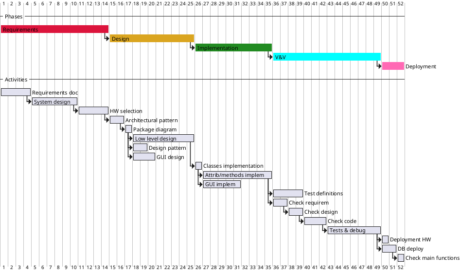

# Project Estimation  
Authors:
Date:
Version:
# Contents
- [Estimate by product decomposition]
- [Estimate by activity decomposition ]
# Estimation approach
<Consider the EZGas  project as described in YOUR requirement document, assume that you are going to develop the project INDEPENDENT of the deadlines of the course>
# Estimate by product decomposition
### 
|             | Estimate                        |             
| ----------- | ------------------------------- |  
| NC =  Estimated number of classes to be developed   |              20               |             
|  A = Estimated average size per class, in LOC       |               300             | 
| S = Estimated size of project, in LOC (= NC * A) | 6000 |
| E = Estimated effort, in person hours (here use productivity 10 LOC per person hour)  |              600                        |   
| C = Estimated cost, in euro (here use 1 person hour cost = 30 euro) | 18'000€ | 
| Estimated calendar time, in calendar weeks (Assume team of 4 people, 8 hours per day, 5 days per week ) | 10 calendar weeks |               
# Estimate by activity decomposition
### 
|         Activity name    | Estimated effort (person hours)   |             
|  ------------------------| :-------------------------------: | 
| <Strong>Requirements</Strong>| |
| Read customer requests | 2 |
| Identify user needs | 4 |
| Identify stakeholders, actors and stories | 2 |
| Define functional requirements | 5 |
| Define performance requirement| 6 |
| Define use cases and scenarios | 15 |
| System design decision  | 50 |
| HW support requirement | 30 |
| Customer checks | 20 |
| <Strong>Design</Strong> | |
| Architectural pattern decision | 10 |
| Package diagram design | 5 |
| Low level design | 80 |
| Design pattern implementation | 10 |
| Low level design control and review | 10 |
| GUI design and prototype| 35 |
| <Strong>Implementation </Strong>| |
| Class and package implementation| 4 |
| Attributes and methods implementation | 70 |
| GUI implementation | 40 |
| <Strong>V&V</Strong>  ||
| Check of requirements | 15 |
| Check of design | 15 |
| Check of code | 20 |
| Test definitions | 30 |
| Test execution and error reporting | 20 |
| Error fixing & debugging | 40 |
| <Strong>Deployment</Strong>||
| Deployment on HW | 6 |
| Database deployment | 10 |
| Check of main functions | 4 |

Total = 528 person hours

###

