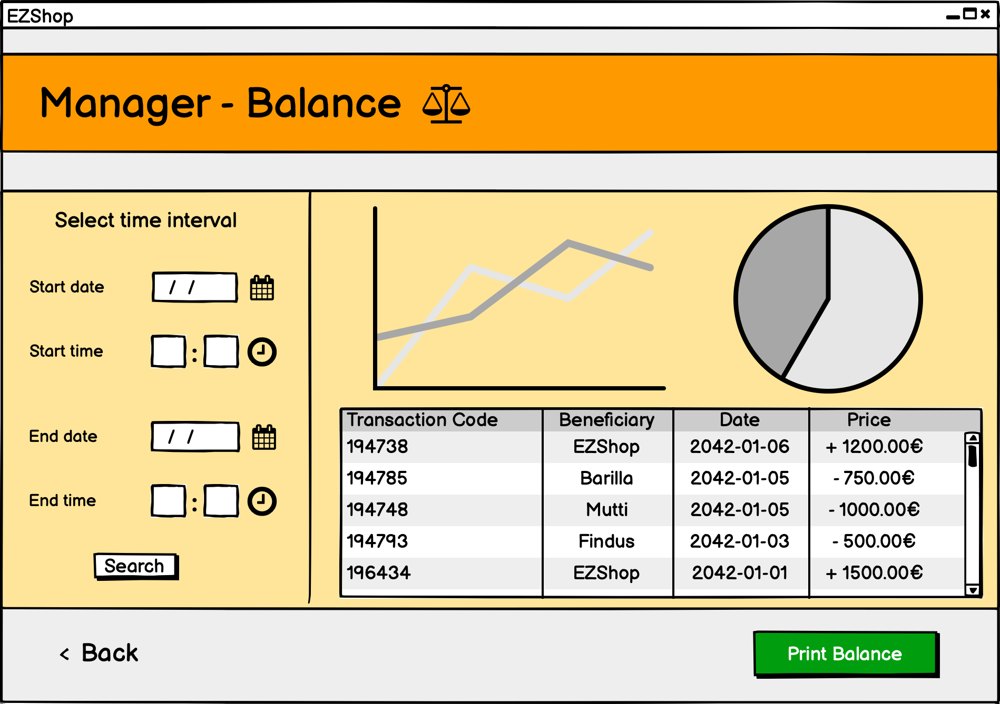
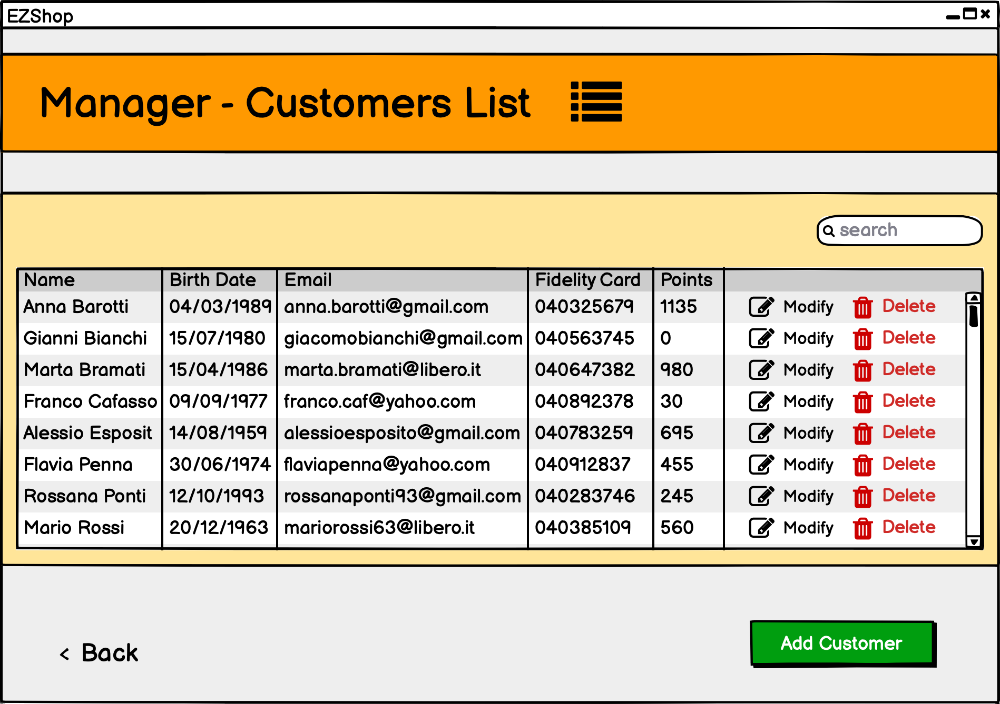
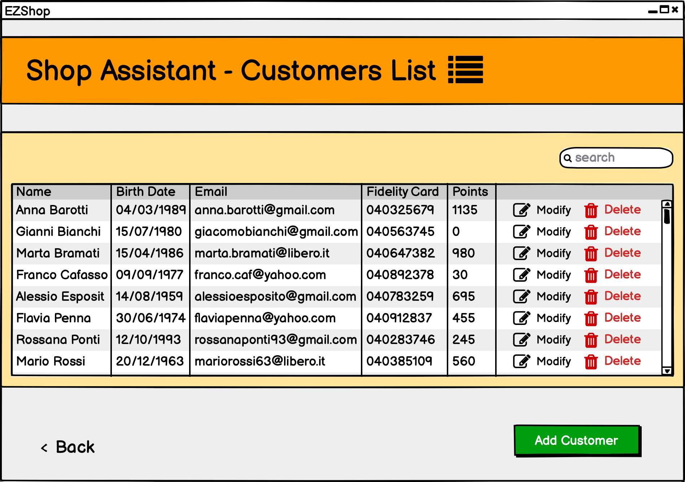
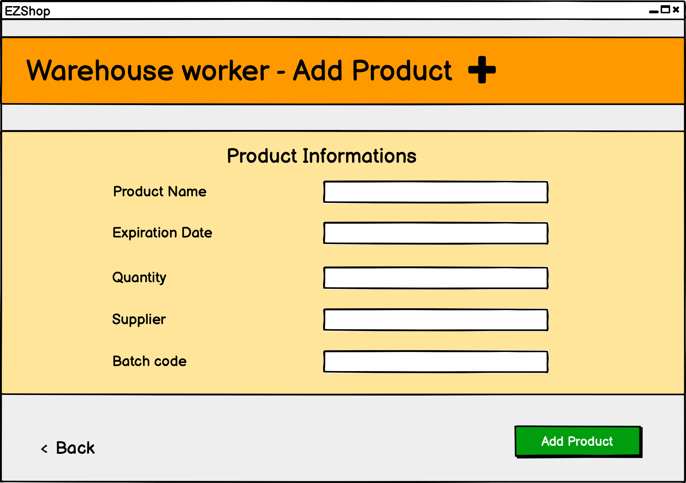
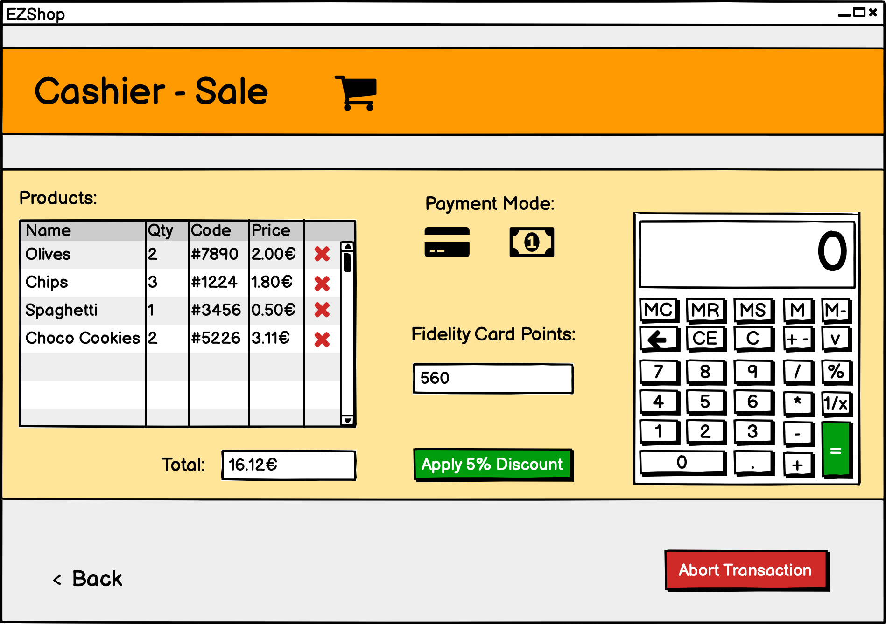
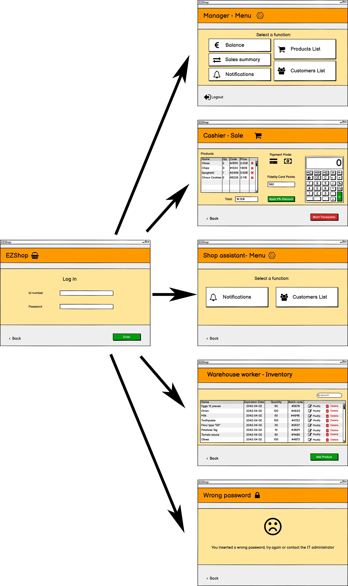
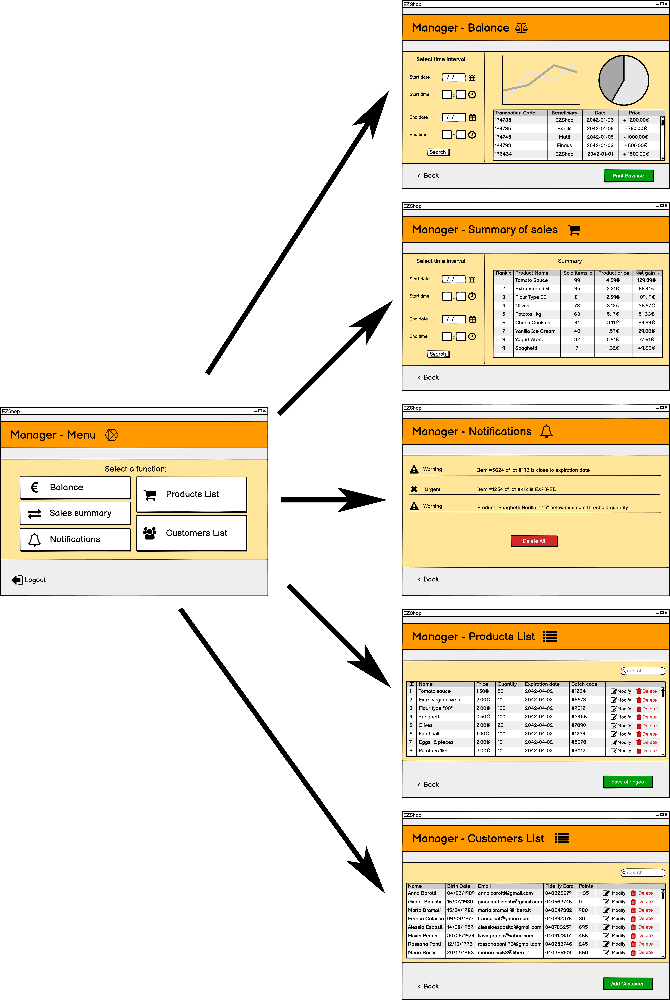
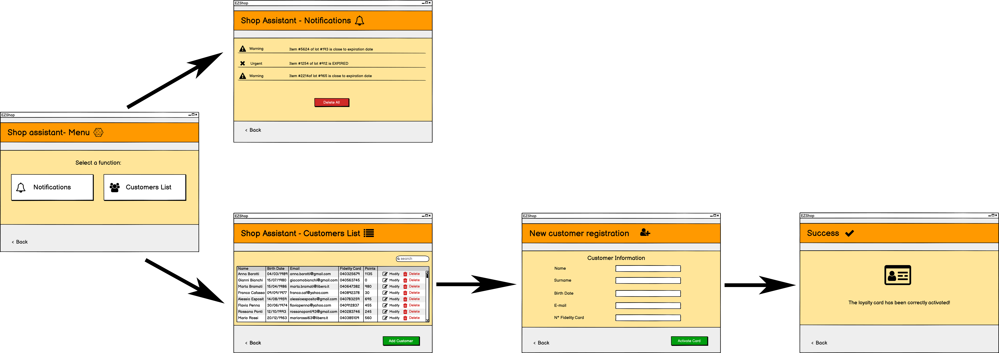
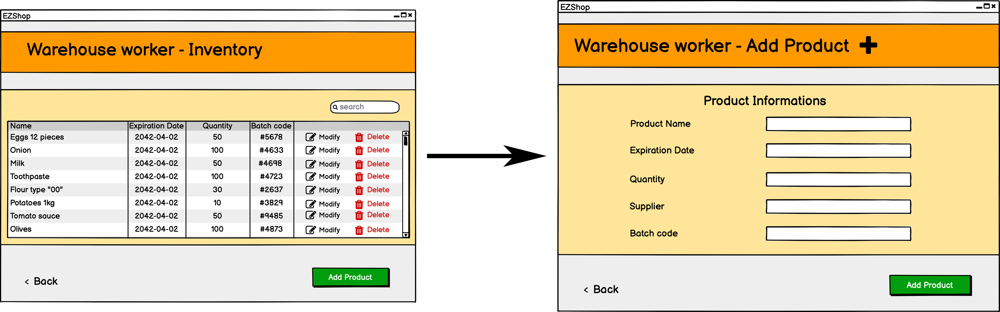

# Graphical User Interface Prototype  

Authors: Marco Ballario, Pietro Macori, Cosimo Michelagnoli, Lucia Vencato

Date: 21/04/2021

Version: 1.0

# Contents

- [Screenshots](#screenshots)
    - [Screenshot 1: Login](#screenshot-1-login)
    - [Screenshot 2: Failed Login](#screenshot-2-failed-login)
    - [Screenshot 3: Manager Menu](#screenshot-3-manager-menu)
    - [Screenshot 4: Manager Balance](#screenshot-4-manager-balance)
    - [Screenshot 5: Manager Customers List](#screenshot-5-manager-customers-list)
    - [Screenshot 6: Manager Summary Of Sales](#screenshot-6-manager-summary-of-sales)
    - [Screenshot 7: Manager Notifications](#screenshot-7-manager-notifications)
    - [Screenshot 8: Manager Products List](#screenshot-8-manager-products-list)
    - [Screenshot 9: Shop Assistant Menu](#screenshot-9-shop-assistant-menu)
    - [Screenshot 10: Shop Assistant Notifications](#screenshot-10-shop-assistant-notifications)
    - [Screenshot 11: Shop Assistant Customers List](#screenshot-11-shop-assistant-customers-list)
    - [Screenshot 12: Shop Assistant New Customer Registration](#screenshot-12-shop-assistant-new-customer-registration)
    - [Screenshot 13: Shop Assistant New Customer Successfully Registered](#screenshot-13-shop-assistant-new-customer-successfully-registered)
    - [Screenshot 14: Warehouse Worker Inventary](#screenshot-14-warehouse-worker-inventary)
    - [Screenshot 15: Warehouse Worker Add Product](#screenshot-15-warehouse-worker-add-product)
    - [Screenshot 16: Cashier Sale](#screenshot-16-cashier-sale)
    - [Screenshot 17: Operation Completed Successfully](#screenshot-17-operation-completed-successfully)
- [Storyboards](#storyboards)
    - [Storyboard 1: Login](#storyboard-1-login)
    - [Storyboard 2: Manager](#storyboard-2-manager)
    - [Storyboard 3: Shop Assistant](#storyboard-3-shop-assistant)
    - [Storyboard 4: Warehouse Worker](#storyboard-4-warehouse-worker)

# Screenshots

## Screenshot 1: Login

## Screenshot 2: Failed Login

## Screenshot 3: Manager Menu

## Screenshot 4: Manager Balance

## Screenshot 5: Manager Customers List

## Screenshot 6: Manager Summary Of Sales

## Screenshot 7: Manager Notifications

## Screenshot 8: Manager Products List

## Screenshot 9: Shop Assistant Menu

## Screenshot 10: Shop Assistant Notifications

## Screenshot 11: Shop Assistant Customers List

## Screenshot 12: Shop Assistant New Customer Registration

## Screenshot 13: Shop Assistant New Customer Successfully Registered

## Screenshot 14: Warehouse Worker Inventary

## Screenshot 15: Warehouse Worker Add Product

## Screenshot 16: Cashier Sale

## Screenshot 17: Operation Completed Successfully

# Storyboards

## Storyboard 1: Login

## Storyboard 2: Manager

## Storyboard 3: Shop Assistant

## Storyboard 4: Warehouse Worker

