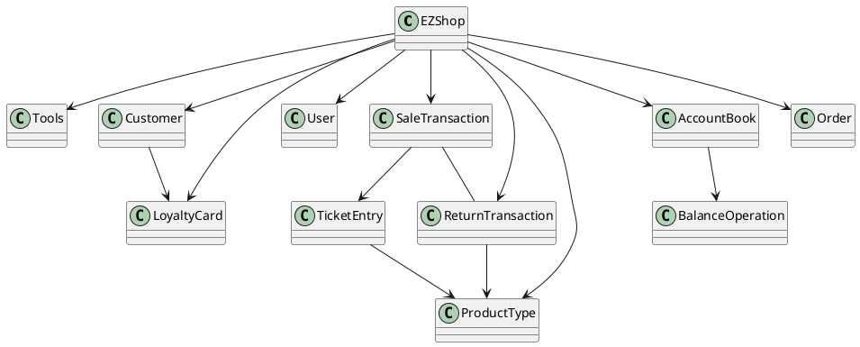

# Integration and API Test Documentation

Authors: Marco Ballario, Pietro Macori, Cosimo Michelagnoli, Lucia Vencato

Date: 20/05/2021

Version: 1.0

# Contents

- [Dependency graph](#dependency graph)

- [Integration approach](#integration)

- [Tests](#tests)

- [Scenarios](#scenarios)

- [Coverage of scenarios and FR](#scenario-coverage)
- [Coverage of non-functional requirements](#nfr-coverage)

# Dependency graph 

     
# Integration approach

    The integration approach choosen is the bottom up one. We starts from the Unit Tests delivered previously as base 
    for the integration tests. 
    As first step we consider the integraton of class' methods that depend on other classes (step 1).
    Once they have been tested, the couple of class can be considered as an unique entity and can be used for the following
    steps (step 2).
    Once all the classes of the model package have been correctly tested we start integrating at API level (step 3).
    

#  Tests

## Step 1
| Classes  | JUnit test cases |
|--|--|
|AccountBook, BalanceOperation   (Class TestAccountAndBalanceOp)|testInsertBalanceOperationCredit()|
||testInsertBalanceOperationDebit()|
||testInsertBalanceOperationNoMoney()|
||testGetList()|
|Customer, LoyaltyCard   (Class TestCustomerAndLoyalty)|testSetLoyalty()|
||testSetPoints()|
|ProductType, TicketEntry   (Class TestProductTypeAndTicket)|testTicketConstructor|

## Step 2
| Classes  | JUnit test cases |
|--|--|
|ProductType, TicketEntry, SaleTransaction   (Class TestSaleAndTicket)|testSetTicketEntries()|
||testAddProductNull()|
||testAddProductNotPresent()|
||testAddProductAlreadyPresent()|
||testProductDiscFail()|
||testProductDisc()|
||testDeleteProductNegAmount()|
||testDeleteProductNotExists()|
||testDeleteProduct()|
|ProductType,ReturnTransaction,SaleTransaction   (Class TestReturnAndProduct)|testAddProduct()|
||testAddProductAlreadyPresent()|
| SaleTransaction,ReturnTransaction, ProductType   (Class TestSaleAndReturn)|testSetReturnTransaction() |
| |testStutusPlusNoReturnId()|
| |testStutusPlusNegId()|
| |testStutusPlus()|
| |testSetOriginalTransaction()|

## Step 3
| Classes  | JUnit test cases |
| --| -- |
|EZShop, User |testUserAPI()|
||testWrongCreateUser()|
||testWrongIdAndRoleUser()|
||testLogin()|
|EZShop, ProductType|testProductTypeAPI()|
||testGetAllProducts()|
||testUpdateProduct()|
|EZShop, Order|testOrdersAPI()|
||testIssueAndPayOrder()|
||testArrivalOrder()|
||testAllOrders()|
|EZShop, Customer, LoyaltyCard|testCustomersCards()|
||testCustomersAPI()|
||testSearchCustomer()|
||testAllCustomers()|
|EZShop, SaleTransaction, TicketEntry|testSaleTransactionAPI()|
||testManageSaleTransaction()|
||testManageSaleTransactionProductDiscount()|
||testManageSaleTransactionDiscount()|
|EZShop, ReturnTransaction|testReturnTransactionAPI()|
||testManageReturnTransactionCreditCard()|
||testManageReturnTransactionCash()|
|EZShop, AccountBook|testComputeBalance()|
||testGetCreditsAndDebits()|
|EZShop|testReset()|

# Scenarios

## Scenario UC1.4
| Scenario |  Delete ProductType |
| ------------- |:-------------:| 
|  Precondition     | ProductType P exists, User U logged |
|  Post condition     | P is not more in the system  |
| Step#        | Description  |
|  1     |  U search the product via barcode  |  
|  2     |  U deletes P |

## Scenario UC3.4
| Scenario |  List all orders |
| ------------- |:-------------:| 
|  Precondition     | User U logged |
|  Post condition     | List of orders visualized  |
| Step#        | Description  |
|  1     |  User lists all orders  |  

## Scenario UC4.5
| Scenario |  Delete Customer |
| ------------- |:-------------:| 
|  Precondition     | Account U for Customer Cu must exist |
|  Post condition     | U is not into the system anymore  |
| Step#        | Description  |
|  1     |  User search for U  |  
|  2     |  User deletes the user |

## Scenario UC8.3
| Scenario |  Abort return transaction |
| ------------- |:-------------:| 
|  Precondition     | Return transaction RT exists, cashier C is logged |
|  Post condition     | RT aborted |
|      | Product quantites is not update |
|      | Balance is not updated |
| Step#        | Description  |
|  1     |  Customer decides to abort the return |  
|  2     |  C rollback the return transaction |
|  3     |  Return transaction aborted, no change will be recorded |

# Coverage of Scenarios and FR

| Scenario ID | Functional Requirements covered | JUnit  Test(s) | 
| ----------- | ------------------------------- | ----------- |
| 1-1, 1-4 | FR3.1, FR3.2,FR3.3, FR3.4 | testProductTypeAPI(), testGetAllProducts()|
| 1-2, 1-3 | FR3.1| testUpdateProduct() |
| 2-1, 2-2, 2-3| FR1.1, FR1.2, FR1.5 | testUserAPI() |
| 3-1| FR4.3| testOrdersAPI() |
| 3-2 |FR4.4, FR4.5 |testIssueAndPayOrder() |
| 3-3 | FR4.6 |testArrivalOrder() |
| 3-4 | FR4.7 | testAllOrders() |
| 4-1 | FR5.1, FR5.2 | testCustomersAPI() |
| 4-2, 4-3, 4-4 | FR5.1, FR5.5, FR5.6, FR5.7 | testCustomersCards() |
| 4.5 | FR-5.2, FR5.3 | testSearchCustomer()  testCustomersAPI() |
|  5-1, 5-2     |   FR1.5   |       testLogin(), testWrongIdAndRoleUser()    |             
| 6-1, 6-6, 7-4 |    FR4.1, FR6.1, FR6.2,  FR6.7, FR6.10,  FR7.1, FR8.4   |   testManageSaleTransaction() |             
| 6-2  |  FR4.1, FR6.1, FR6.2, FR6.5,  FR6.7, FR6.10,  FR7.1, FR8.4 |testManageSaleTransactionProductDiscount()   |             
| 6-3  |   FR4.1, FR6.1, FR6.2,  FR6.6, FR6.7, FR6.10, FR7.1, FR8.4  |  testManageSaleTransactionDiscount()| 
| 6-4, 7-1, 7-2  |  FR4.1,FR5, FR5.5, FR5.6, FR5.7, FR6.1, FR6.2,  FR6.7, FR6.10,  FR7.1, FR8.4  |  testSaleTransactionAPI()   testCustomersCards()|   
| 6-5  |  FR4.1,FR6.1, FR6.2, FR6.10, FR6.11 | testManageSaleTransactionCancelled() |            
| 8-1, 10-1 | FR4.1, FR6.12, FR6.13, FR6.14, FR6.15, FR7.4, FR8.4 | testReturnTransactionAPI()   testManageReturnTransactionCreditCard()  |
| 8-2, 10-2 | FR4.1, FR6.12, FR6.13, FR6.14, FR6.15, FR7.3, FR8.4 | testReturnTransactionAPI()   testManageReturnTransactionCash()  |
|8.3| FR6.15 | testReturnTransactionAPI()|
| 9-1 | FR8.3 | testGetCreditsAndDebits() |

# Coverage of Non Functional Requirements

### 

| Non Functional Requirement | Test name |
| -------------------------- | --------- |
|          NFR4              |    testMore14() testLess12() testAlphabetInput() testNegative() testInvalidCode() test14Digits() test13Digits() test12Digits() (Class TestCheckDigits)   |
|          NFR5              |   testSizeNot16() testAlphabetInputCard() testNegativeCard() testInvalidCard() test16Digits() (Class TestLuhn)    |

