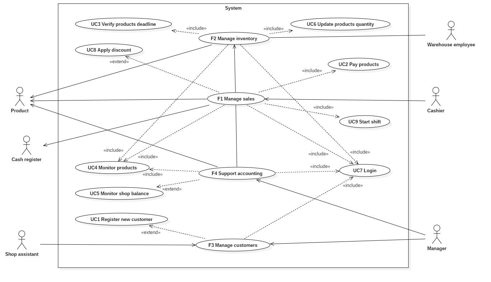
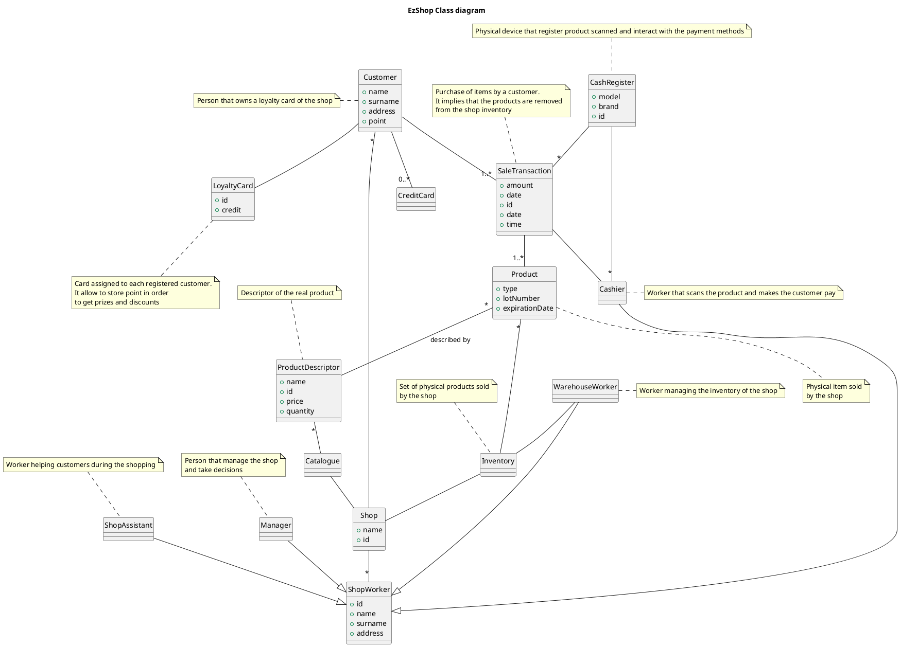

# Requirements Document 

Authors: Marco Ballario, Pietro Macori, Cosimo Michelagnoli, Lucia Vencato

Date: 21/04/2021

Version: 1.0

# Contents

- [Essential description](#essential-description)
- [Stakeholders](#stakeholders)
- [Context Diagram and interfaces](#context-diagram-and-interfaces)
	+ [Context Diagram](#context-diagram)
	+ [Interfaces](#interfaces) 
- [Stories and personas](#stories-and-personas)
- [Functional and non functional requirements](#functional-and-non-functional-requirements)
	+ [Functional Requirements](#functional-requirements)
	+ [Non functional requirements](#non-functional-requirements)
- [Use case diagram and use cases](#use-case-diagram-and-use-cases)
	+ [Use case diagram](#use-case-diagram)
	+ [Use cases](#use-cases)
    	+ [Relevant scenarios](#relevant-scenarios)
- [Glossary](#glossary)
- [System design](#system-design)
- [Deployment diagram](#deployment-diagram)

# Essential description

Small shops require a simple application to support the owner or manager. A small shop (ex a food shop) occupies 50-200 square meters, sells 500-2000 different item types, has one or a few cash registers 
EZShop is a software application to:
* manage sales
* manage inventory
* manage customers
* support accounting

# Stakeholders

| Stakeholder name  | Description | 
| ----------------- | ----------- |
|	Customer     		| A person that goes to the shop to buy items and own a loyalty card | 
|   Cashier     		| Shop employee in charge of using the cash register | 
|   Warehouse employee  | Shop employee that manage the warehouse and the products stored in it  |
|   Shop assistant     	| A person in charge of helping customers during the purchase |
|   Manager     		| The owner of the shop |
|   IT administrator    | A single employee responsible for the correct functioning of the IT devices of the shop |
|   Cash register 		| System that stores daily money and can scan products |
|   Product 			| A single item sold by the shop. It's scanned by the cashier |
|   Loyalty card 		| Physical card owned by a single registered customer. It's used to collect customer data, accumulate points and get prizes and discounts |

# Context Diagram and interfaces

## Context Diagram

```plantuml
left to right direction
actor "Cashier" as C
actor "Product" as P
actor "Cash register" as CR
actor "Manager" as M
actor "Shop assistant" as SA
actor "Warehouse employee" as WE
rectangle System{
	(Application) as SW
	C -- SW
	P -- SW
	CR -- SW
	SW -- WE
	SW -- M
	SW -- SA
}
```

## Interfaces

| Actor | Physical Interface | Logical Interface  |
| ------------- | ------------- | ----- |
|   Cashier    | Screen, keyboard |GUI|
|   Product	   | Laser beam		  |Bar code |
|	Cash Register | Lan connection | Cash Register API|
| 	Shop assistant	| Tablet	|GUI|
|	Warehouse worker| Screen, keyboard |GUI	|
|	Manager| Screen, keyboard |GUI	|


# Stories and personas

Anna is 55 and she’s the manager of the shop. She is manager of the market like her dad before her, she grew up there and was accustomed with an older style of managing the shop. The new application changed radically her work, giving her more time to spend with her children and family. The system is able to manage a lot of data faster and better than her and her team.

Gianni  is 58 and he’s the warehouse chief. When he was younger, remember every single item and its quantity in the warehouse was easy. His main problem was keeping the office neat and tidy with all those forms and paper going around to keep track of the goods. The new application is able to reduce time spent writing down numbers and looking for papers, increasing efficiency all around.

Mario is 34 and he’s a shop assistant. With the pandemic creating new difficulties, Mario was too busy helping clients for keeping track of goods to restock through the aisles. The new application can easily keep track of the goods that are bought in order for Mario to be less stressed with following missing goods. Moreover now he can easily find and replace expired items without the need to check a paper based register.

Paola is 23 and she’s a cashier in order to pick up some money during her engineering studies. The introduction of the new application was something she talked about with Anna some weeks before, and now she proudly uses it, with the all around performance of the market growing day by day.

Mariella is 66 and she’s retired. Her friends always tell her that big super market have more advantages for the customer rather than small local market. She was attached to Anna and the personnel working there. Now, knowing that she has a customer card with discounts and points collection was enough to convince her to go back to her trusted little shop.


# Functional and non functional requirements

## Functional Requirements


| ID        | Description  |
| ------------- | ------------- | 
|  FR1    | Manage sales |
|  FR11   | Create a transaction |
|  FR12   | Insert a product in a transaction |
|  FR13   | Remove a product in a transaction |
|  FR14   | Abort a transaction |
|  FR15   | Add points to customer |
|  FR16   | Remove points from customer |
|  FR17   | Apply a discount |
|  FR2   | Manage inventory  |
| FR21  | Add product | 
| FR22  | Remove product | 
| FR23  | Modify quantity |
| FR24  | Search product |
| FR25  | Modify price of a product |
| FR3  | Manage customers |
| FR31  | Add customer |
| FR32  | Delete customer |
| FR32  | Modify customer informations |
| FR33  | Summary of customer informations (points, ...) |
| FR34  | Search a customer |
| FR4  | Support accounting |
| FR41  | Show the product type and the amount of sold items in a period of time  |
| FR42  | Summary of expenses and incomings in a period of time |
| FR43  | Display graph on balance |
| FR5	| Manage rights. Authorize access to functions to specific actors according to access rights |

## Non Functional Requirements

| ID | Type | Description | Refers to |
|-------------|-------------|-----|-----|
| NFR1 | Usability | Installation time < 5 minutes | - |
| NFR2 | Usability | Application learning time < 10 minutes | - |
| NFR3 | Usability | Average application rating from users point of view after a week of usage >= 4/5 stars | - |
| NFR4 | Usability | Average GUI attractiveness rating from users point of view >= 4/5 stars | - |
| NFR5 | Usability | Number of functions to be added after a week of usage = 0 | - |
| NFR6 | Efficiency | Response time to add a new transaction after a month of usage < 0.1 s | FR11 |
| NFR7 | Efficiency | Response time to add a new product after a month of usage < 0.1 s | FR21 |
| NFR8 | Efficiency | Response time to add a new customer after a month of usage < 0.1 s | FR31 |
| NFR9 | Efficiency | Response time to show product type and amount of sold items in a period of time after a month of usage < 0.1 s | FR41 |
| NFR10 | Efficiency | Response time to show the summary of expenses and incomings in a period of time after a month of usage < 0.1 s | FR42 |
| NFR11 | Reliability | Database backup frequency >= 1 backup/week | - |
| NFR12 | Reliability | Availability >= 99% of every day of every week | - |
| NFR13 | Reliability | Overall number of errors per month < 5 | - |
| NFR14 | Reliability | Overall number of application crash per year <= 1 | - |
| NFR15 | Maintainability | Effort to restore a database backup <= 1 man-hour | - |
| NFR16 | Maintainability | Effort to add a new software function <= 2 man-weeks | - |
| NFR17 | Maintainability | Effort to test the correct behaviour of the application <= 1 man-hour | - |		
| NFR18 | Portability | Effort to move the application from an old machine to a new one with the same OS <= 2 man-hours | - |
| NFR19 | Portability | Effort to move the application from an old machine to a new one with a different OS <= 3 man-hours | - |
| NFR20 | Portability | Effort to change the DBMS <= 3 man-hours	| - |
| NFR21 | Privacy | Number of customer data not encrypted = 0 bytes	| FR3 |
| NFR22 | Security | Number of malicious accesses per year = 0 | FR5 |

# Use case diagram and use cases

## Use case diagram



### Use case 1, UC1 - Register new customer
| Actors Involved        | Shop assistant, cashier ,customer |
| ------------- | ------------- | 
|  Precondition     | The customer requests a loyalty card |  
|  Post condition     | The customer has an account, owns an active loyalty card |
|  Nominal Scenario     | The customer requests to the cashier to have a card, the cashier makes her fill and sign a document which is given to an avaiable shop assistant. The shop assistant creates a new user into the system and activates a card. The card is delivered to the customer|
|  Variants     | The manager can do the shop assistant job if needed |

##### Scenario 1.1 

| Scenario 1.1 | |
| ------------- | ------------- | 
|  Precondition     | Customer not already registered or registered but the card has expired |
|  Post condition     | Customer registered, owns an activated card |
| Step#        | Description  |
|  1     | Customer requests a card to the cashier |  
|  2     | Cashier hands a document to be filled and signed by the customer |
|  3     | Document delivered to the shop assistant |
|  4     | Shop assistant enters data inside the application  |
|  5     | Account correctly created |
|  6     | Card activated |
|  7     | Card number inserted in the customer account |
|  8     | Card and a copy of the document handed to the customer |

##### Scenario 1.2

| Scenario 1.2 | |
| ------------- | ------------- | 
|  Precondition     | Customer already registered and card is still valid |
|  Post condition     | Customer registered, owns an activated card |
| Step#        | Description  |
|  1     | Customer requests a card to the cashier |  
|  2     | Cashier hands a document to be filled and signed by the customer |
|  3     | Document delivered to the shop assistant |
|  4     | Shop assistant enters data inside the application  |
|  5     | Application returns an error |
|  6     | Customer informed that she already owns a valid card |

##### Scenario 1.3 
| Scenario 1.3 | |
| ------------- | ------------- | 
|  Precondition     | Customer already registered but she lost her card |
|  Post condition     | Customer owns a new activated card, old card is disabled |
| Step#        | Description  |
|  1     | Customer reports to the cashier that she lost her loyalty card  |  
|  2     | Cashier hands a dedicated document to be filled and signed by the customer |
|  3     | Document delivered to the shop assistant |
|  4     | Shop assistant disable the old card and activates a new one |
|  5     | Customer account is updated with the new card number|
|  6     | New card handed to the customer |

### Use case 2, UC2 - Pay products
| Actors Involved        | Cashier, customer, product |
| ------------- | ------------- | 
|  Precondition     | All products scanned by the cashier, customer pays, loyalty card scanned before payment  |  
|  Post condition     | Points are added to customer account, products quantity are updated |
|  Nominal Scenario     | The cashier scans all items and the loyalty card, the customer pays the due amount. The points are added to customer account and the bought items are removed from the inventory |

##### Scenario 2.1
| Scenario 2.1 | |
| ------------- | ------------- | 
|  Precondition     | Card is valid |
|  Post condition     | Points are added to the account  |
| Step#        | Description  |
|  1     | Customer hands the fidelity card to the cashier  |  
|  2     | Cashier scans the card |
|  3     | Payment is performed (both cash and credit card are fine) |
|  4     | Points are added to the customer account |
|  5     | Products quantities are updated |

##### Scenario 2.2
| Scenario 2.2 | |
| ------------- | ------------- | 
|  Precondition     | Card is expired |
|  Post condition     | No points are added to the account  |
| Step#        | Description  |
|  1     | Customer hands the fidelity card to the cashier  |  
|  2     | Cashier scans the card |
|  3     | The cash register makes an error sound to inform the cashier and the customer |
|  4     | Payment is performed (both cash and credit card are fine) |
|  5     | Products quantities are updated |

### Use case 3, UC3 - Verify products deadline
| Actors Involved        | Shop assistant, product |
| ------------- | ------------- | 
|  Precondition     | All the products in the shop have a valid bar code and a defined expiring date  |  
|  Post condition     | 20% discounts are applied to expiring products prices and expired products are discarded |
|  Nominal Scenario     | The application notifies the shop assistant expired products in the shop. New prices are applied to expiring products. The shop assistant discards expired products |

##### Scenario 3.1
| Scenario 3.1 | |
| ------------- | ------------- | 
| Precondition	| Shop assistant exists and has valid account |
|				| Product has a valid barcode and it's expired  |
| Post condition| Expired products removed from inventory and from shelves |
| Step#        | Description  |
| 1		| Application removes the product from the inventory |
| 2		| Application notifies the shop assistant about the expired product |
| 3		| Shop assistant removes the product |

##### Scenario 3.2
| Scenario 3.2 | |
| ------------- | ------------- | 
| Precondition	| Shop assistant exists and has valid account |
|				| Product has a valid barcode and it's close to his expiring date |
| Post condition| 20% discount applied to the product |
| | Product move to the "expiring products" shelf of the shop |
| Step#        | Description  |
| 1		| Application changes the price for the product |
| 2		| Application notifies the shop assistant about the expiring product |
| 3		| Shop assistant moves the product to the correct shelf |


### Use case 4, UC4 - Monitor products
| Actors Involved        | Manager |
| ------------- | ------------- | 
|  Precondition     | Manager logs in the application and checks data  |  
|  Post condition     | Data are modified |
|  Nominal Scenario     | Manager checks the data to monitor the sales |

##### Scenario 4.1
| Scenario 4.1 | |
| ------------- | ------------- | 
|  Precondition     | Manager checks the less purchased products of the week |
|  Post condition     | Product price is updated  |
| Step#        | Description  |
|  1     | Manager checks the inventory |  
|  2     | Manager checks the less purchased product |
|  3     | Manager applies a discount to that product |

##### Scenario 4.2
| Scenario 4.2 | |
| ------------- | ------------- | 
|  Precondition     | On Friday manager controls the sales of the week |
|  Post condition     | A list of products to be bought is made  |
| Step#        | Description  |
|  1     | Manager checks the inventory |  
|  2     | Manager checks the products with the quantity lower than a threshold |
|  3     | Manager contacts the supplier to have more quantity of those products |

### Use case 5, UC5 - Monitor shop balance
| Actors Involved        | Manager |
| ------------- | ------------- | 
|  Precondition     | Manager logs in the application and analyses the balance for a selected period of time  |  
|  Post condition     | Balance is possibly printer |
|  Nominal Scenario     | Manager checks the balance to analyse the status of the shop |

##### Scenario 5.1
| Scenario 5.1 | |
| ------------- | ------------- | 
|  Precondition     | Manager wants to check the balance of the shop |
|  Post condition     | The ledger is checked and possibly printed |
| Step#        | Description  |
|  1   | Manager does the login |  
|  2   | Manager enters in the balance page |
|  3   | Manager selects a specific peroiod of time |
|  4   | Graphs about the trend of the shop are showed by the application |
|  5   | Manager possibly prints the balance for the selected period of time |


### Use case 6, UC6 - Update products quantity
| Actors Involved        | Warehouse worker, Product |
| ------------- | ------------- | 
|  Precondition     | Warehouse worker controls the products in the warehouse or supplier truck  |  
|  Post condition     | Products quantity is updated in the application inventory |
|  Nominal Scenario     | Warehouse worker updates the products quantity in the application if he notices that it’s wrong or when the supplier truck arrives |

##### Scenario 6.1
| Scenario 6.1 | |
| ------------- | ------------- | 
|  Precondition     | The quantity of products actually presents in the warehouse and the one in the inventory are not the same |
|  Post condition     | Products quantity in the inventory is corrected |
| Step#        | Description  |
|  1     | Warehouse worker notices that the quantity of a product in the inventory is different from the one available in the warehouse   |  
|  2     | Warehouse worker modifies the quantity of that product in the application |

##### Scenario 6.2
| Scenario 6.2 | |
| ------------- | ------------- | 
|  Precondition     | Supplier truck arrives with the products |
|  Post condition     | Products quantity in the inventory is updated |
| Step#        | Description  |
|  1     | Products are unloaded from the truck  |  
|  2     | Warehouse worker checks the quantity |
|  3     | Warehouse worker updates the quantity of the products in the application inventory |

### Use case 7, UC7 - Login
| Actors Involved        | Warehouse worker, Shop assistant, Cashier, Warehouse worker |
| ------------- | ------------- | 
|  Precondition     | User is logged out  |  
|  Post condition     | User is logged in |
|  Nominal Scenario     | User wants to enter in the application and inserts id code and password |

##### Scenario 7.1
| Scenario 7.1 | |
| ------------- | ------------- | 
|  Precondition     | User is currently logged out and enter a correct password |
|  Post condition     | User correctly logged in and redirected to the application |
| Step#        | Description  |
|  1     | User enter id code|
|  2     | User enter correct password|  
|  2     | Application shows the starting page (changes depending on the user role) |


##### Scenario 7.2
| Scenario 7.2 | |
| ------------- | ------------- | 
|  Precondition     | User is currently logged out and enter a wrong password |
|  Post condition     | Application displays an error page |
|     | User logged out |
| Step#        | Description  |
|  1     | User enter id code |
|  2     | User enter wrong password|  
|  2     | Application shows an error page |

### Use case 8, UC8 - Apply discount
| Actors Involved        | Cashier |
| ------------- | ------------- | 
|  Precondition     | Customer has a loyalty card and requests for discount|  
|  Post condition     | Discount applied  |
|  Nominal Scenario     | Cashier pushes a button on the screen and a 5% discount is applied, 500 points are removed|

##### Scenario 8.1
| Scenario 8.1 | |
| ------------- | ------------- | 
|  Precondition     | Customer has at least 500 points |
|  Post condition     | 5% discount applied to transaction |
|      | 500 point removed from customer  |
| Step#        | Description  |
|  1     | Customer asks for a discount |
|  2     | Cashier press the discount button|  
|  3     | 5% discount applied to transaction |
|  4     | operations continues  |

##### Scenario 8.2
| Scenario 8.2 | |
| ------------- | ------------- | 
|  Precondition     | Customer has less than 500 points |
|  Post condition     | No discount applied |
|        | No point removed |
| Step#        | Description  |
|  1     | Customer asks for a discount |
|  2     | Cashier try to press the DISABLED discount button|  
|  3     | No discount applied |


### Use case 9, UC9 - Start shift
| Actors Involved        | Cashier |
| ------------- | ------------- | 
|  Precondition     | Prevoius cashier logged out from the computer|  
|  Post condition     | Current cashier logs in and can start working  |
|  Nominal Scenario     | Cashier does the login, the correct gui is diplayed and the cashier can start scanning the products|

##### Scenario 9.1
| Scenario 9.1 | |
| ------------- | ------------- | 
|  Precondition     | Computer turned on |
|       | Prevoius cashier logged out from the computer |
|  Post condition     | Cashier scans the products |
| Step#        | Description  |
|  1     | Cashier does the login |
|  2     | The correct GUI is displayed (showing the current transaction, the scanned products and the total cost)|  
|  3     | The cashier can serve the first customer, scanning the product and dealing with the payment  |

# Glossary



# System Design

Not really meaningful in this case. Only software components are needed.

# Deployment Diagram 

```plantuml
node Manager_PC
node Warehouse_employee_PC
database Database
node Shop_assistant_tablet
node Cashier_PC
node Shop_Central_Server

artifact DesktopApp1
artifact DesktopApp2
artifact AndroidApp
artifact DesktopApp4


Shop_Central_Server -- Manager_PC
Shop_Central_Server -- Warehouse_employee_PC
Shop_Central_Server -- Database
Shop_Central_Server -- Shop_assistant_tablet
Shop_Central_Server -- Cashier_PC
Manager_PC -- DesktopApp1
Shop_assistant_tablet -- AndroidApp
Warehouse_employee_PC -- DesktopApp2
Cashier_PC -- DesktopApp4

```

